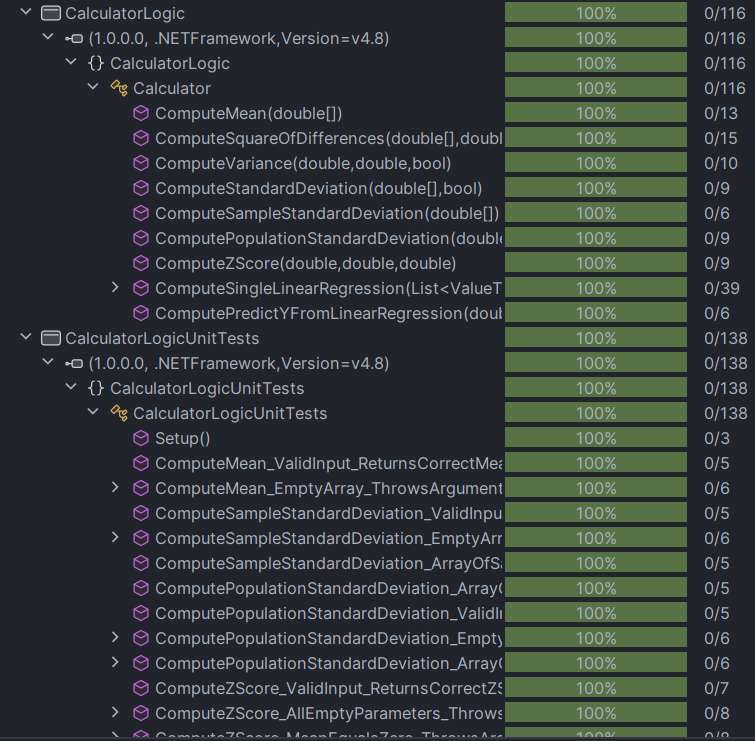

# swe-3643-fall-2024-project
Fall 2024 SWE Calculator Project
Zachary Gray
Miguel Ramirez

---

# Introduction

---

# KSU SWE 3643 Software Testing and Quality Assurance Semester Project: Web-Based Calculator
This repository contains the source code for our SWE 3643 calculator project.
Documentation regarding our Introduction, Table of Contents, Team Members, Architecture, Environment, Executing the Web Application, Executing Unit Tests, Reviewing Unit Test Coverage, Executing End-To-End Tests and Final Video Presentation
can be found here in the README.md file.

---

## Table of Contents
- [Team Members](#team-members)
- [Environment](#environment)
- [Architecture](#architecture)
- [Environment](#environment)
- [Executing the Web Application](#executing-the-web-application)
- [Executing Unit Tests](#executing-unit-tests)
- [Reviewing Unit Test Coverage](#reviewing-unit-test-coverage)
- [Final Video Presentation](#final-video-presentation)
---

# Team Members
Zachary Gray and Miguel Ramirez
---

# Architecture


---

# Environment
This is a cross-platform application and should work in Windows 10+, macOS Ventura+, and Linux environments. However, the application has only been carefully tested on Windows 11.

To prepare your environment to execute this application, follow the steps below:

## Prerequisites

1. **Install .NET SDK**
    - Download and install the latest version of the .NET SDK from the official [Microsoft website](https://dotnet.microsoft.com/download).
    - You can verify the installation by running the following command:
      ```bash
      dotnet --version
      ```

2. **Install Node.js and npm**
    - Install the latest stable version of [Node.js](https://nodejs.org/).
    - Verify the installation with:
      ```bash
      node --version
      npm --version
      ```

3. **Install Playwright for End-to-End Testing**
    - To set up Playwright for end-to-end testing, run:
      ```bash
      npm install playwright
      ```
    - To install the necessary browsers for Playwright, run:
      ```bash
      npx playwright install
      ```

4. **Install NUnit for Unit Testing**
    - For running unit tests, you need to install NUnit. You can do this using NuGet:
      ```bash
      dotnet add package NUnit
      ```

## Environment Setup for Running the Web Application

1. Clone the repository:
   ```bash
   git clone https://github.com/2GrayZ2/swe-3643-fall-2024-project
   cd (your path here)
2. Build the application:
    ```bash
    dotnet build
3. Run the application:
    ```bash
   dotnet run
   
---

# Executing the Web Application

Follow these steps to build and execute the web application directly from the command line. An IDE is not required.

### Steps to Build and Run

1. **Navigate to the Application Directory**
    - Open a terminal/command prompt/powershell and navigate to the directory where you cloned the repository:
      ```bash
      # (for example)
      cd "D:\GitHub Repositories\swe-3643-fall-2024-project\src\CalculatorWebServerApp\CalculatorWebServerApp\bin\Debug\net8.0"
      ```

2. **Build the Application**
    - Navigate to the root directory of the project (where the `.csproj` file is located) and run the following command to build the application:
      ```bash
      cd "D:\GitHub Repositories\swe-3643-fall-2024-project\src\CalculatorWebServerApp"
      dotnet build
      ```
    - Sample output:
      ```bash
      Microsoft (R) Build Engine version 17.5.0+57d1da9d5 for .NET
      Copyright (C) Microsoft Corporation. All rights reserved.
 
      Restore completed in 89.24 ms for /path/to/yourproject/yourproject.csproj.
      Build succeeded.
          0 Warning(s)
          0 Error(s)
 
      Time Elapsed 00:00:01.75
      ```

3. **Run the Application**
    - After building the application, navigate to the `bin\Debug\net8.0` directory where the compiled DLL is located and run the following command:
      ```bash
      cd "D:\GitHub Repositories\swe-3643-fall-2024-project\src\CalculatorWebServerApp\CalculatorWebServerApp\bin\Debug\net8.0"
      $env:ASPNETCORE_URLS = "http://localhost:5098"
      dotnet CalculatorWebServerApp.dll
      ```
    - Sample output:
      ```bash
      info: Extensions.Hosting.AsyncInitialization.RootInitializer[0]
            Starting async initialization
      info: Microsoft.Hosting.Lifetime[14]
            Now listening on: https://localhost:5098
      info: Microsoft.Hosting.Lifetime[14]
            Application started. Press Ctrl+C to shut down.
      info: Microsoft.Hosting.Lifetime[0]
            Hosting environment: Development
      ```

By following these updated steps, the `dotnet build` command will be executed in the appropriate location, and the application will be built and then run from the `bin\Debug\net8.0` directory.


4. **Connect to the Application**
    - After the application starts, open a web browser on the same machine and navigate to:
      ```
      http://localhost:5098
      ```
    - Replace `5098` with the port number shown in the sample output if it differs.

### Common Issues

1. **Port Already in Use**
    - If you encounter an error similar to:
      ```
      Unhandled IO exception: Failed to bind to https://127.0.0.1:5000: address already in use.
      ```
        - This means another process is already using the application’s HTTP port. To resolve:
            1. Find the process using the port:
               ```bash
               netstat -ano | findstr :5000
               ```
            2. Kill the process (replace `<PID>` with the process ID):
               ```bash
               taskkill /PID <PID> /F
               ```
            3. Restart the application.

2. **Missing Dependencies**
    - Ensure you’ve installed all prerequisites as described in the [Environment Setup](#environment-setup-for-running-the-web-application) section.

By following these steps, your web application should build and run successfully, allowing you to interact with it through your browser.

---

# Executing Unit Tests
1. Build the test project:
    ```bash
   dotnet build Tests/CalculatorLogicUnitTests/CalculatorLogicUnitTests.csproj
2. Run the Unit Tests:
   ```bash
   dotnet test Tests/CalculatorLogicUnitTests/CalculatorLogicUnitTests.csproj


## Executing End-to-End Tests
To ensure the functionality of the application, unit tests have been written and can be executed directly from the command line without the need for an IDE. Follow the steps below to build and run all unit tests.

### Steps to Build and Execute Unit Tests

1. **Navigate to the Project Directory**
   - Open a terminal or command prompt and navigate to the root directory of the project where the `*.csproj` file is located:
     ```bash
     cd yourproject
     ```

2. **Run the Unit Tests**
   - Execute the following command to build the test project and run all unit tests:
     ```bash
     dotnet test
     ```

3. **Review the Test Results**
   - The command will display the status of the executed tests. Look for information on the number of tests passed, failed, or skipped.

### Sample Output

Below is a sample output of running unit tests:

```bash
PowerShell 7.4.6
PS D:\GitHub Repositiories\swe-3643-fall-2024-project\src\CalculatorWebServerApp> cd "D:\GitHub Repositiories\swe-3643-fall-2024-project\src\CalculatorEndToEndTests"
PS D:\GitHub Repositiories\swe-3643-fall-2024-project\src\CalculatorEndToEndTests> dotnet test
  Determining projects to restore...
  Nothing to do. None of the projects specified contain packages to restore.
  CalculatorEndToEndTests -> D:\GitHub Repositiories\swe-3643-fall-2024-project\src\CalculatorEndToEndTests\bin\Debug\CalculatorEndToEndTests.dll
Test run for D:\GitHub Repositiories\swe-3643-fall-2024-project\src\CalculatorEndToEndTests\bin\Debug\CalculatorEndToEndTests.dll (.NETFramework,Version=v4.8)
VSTest version 17.11.1 (x64)

Starting test execution, please wait...
A total of 1 test files matched the specified pattern.
Exception NUnit.Engine.NUnitEngineUnloadException,    Exception thrown unloading tests from D:\GitHub Repositiories\swe-3643-fall-2024-project\src\CalculatorEndToEndTests\bin\Debug\CalculatorEndToEndTests.dll
Exception encountered unloading application domain
   at NUnit.Engine.Services.DomainManager.DomainUnloader.Unload()
   at NUnit.Engine.Runners.TestDomainRunner.UnloadPackage()
   at NUnit.Engine.Runners.AbstractTestRunner.Unload()
   at NUnit.Engine.Runners.MasterTestRunner.UnloadPackage()
   at NUnit.VisualStudio.TestAdapter.NUnitEngine.NUnitEngineAdapter.CloseRunner() in D:\repos\NUnit\nunit3-vs-adapter\src\NUnitTestAdapter\NUnitEngine\NUnitEngineAdapter.cs:line 128
   at NUnit.VisualStudio.TestAdapter.NUnit3TestExecutor.RunAssembly(String assemblyPath, IGrouping`2 testCases, TestFilter filter) in D:\repos\NUnit\nunit3-vs-adapter\src\NUnitTestAdapter\NUnit3TestExecutor.cs:line 259
InnerException: NUnit.Engine.NUnitEngineException: Exception encountered unloading application domain: Error while unloading appdomain. (Exception from HRESULT: 0x80131015)
Application domain name: domain-cd68db46-CalculatorEndToEndTests.dll
Application domain BaseDirectory: D:\GitHub Repositiories\swe-3643-fall-2024-project\src\CalculatorEndToEndTests\bin\Debug\

An exception occurred while invoking executor 'executor://nunit3testexecutor/': Exception encountered unloading application domain
Stack trace:
   at NUnit.Engine.Services.DomainManager.DomainUnloader.Unload()
   at NUnit.Engine.Runners.TestDomainRunner.UnloadPackage()
   at NUnit.Engine.Runners.AbstractTestRunner.Unload()
   at NUnit.Engine.Runners.MasterTestRunner.UnloadPackage()
   at NUnit.VisualStudio.TestAdapter.NUnitEngine.NUnitEngineAdapter.CloseRunner() in D:\repos\NUnit\nunit3-vs-adapter\src\NUnitTestAdapter\NUnitEngine\NUnitEngineAdapter.cs:line 128
   at NUnit.VisualStudio.TestAdapter.NUnitEngine.NUnitEngineAdapter.Dispose() in D:\repos\NUnit\nunit3-vs-adapter\src\NUnitTestAdapter\NUnitEngine\NUnitEngineAdapter.cs:line 132
   at NUnit.VisualStudio.TestAdapter.NUnitTestAdapter.Unload() in D:\repos\NUnit\nunit3-vs-adapter\src\NUnitTestAdapter\NUnitTestAdapter.cs:line 319
   at Microsoft.VisualStudio.TestPlatform.Common.ExtensionDecorators.SerialTestRunDecorator.RunTests(IEnumerable`1 sources, IRunContext runContext, IFrameworkHandle frameworkHandle) in /_/src/Microsoft.TestPlatform.Common/ExtensionDecorators/SerialTestRunDecorator.cs:line 59
   at Microsoft.VisualStudio.TestPlatform.CrossPlatEngine.Execution.RunTestsWithSources.InvokeExecutor(LazyExtension`2 executor, Tuple`2 executorUriExtensionTuple, RunContext runContext, IFrameworkHandle frameworkHandle) in /_/src/Microsoft.TestPlatform.CrossPlatEngine/Execution/RunTestsWithSources.cs:line 116
   at Microsoft.VisualStudio.TestPlatform.CrossPlatEngine.Execution.BaseRunTests.<>c__DisplayClass46_0.<RunTestInternalWithExecutors>b__0() in /_/src/Microsoft.TestPlatform.CrossPlatEngine/Execution/BaseRunTests.cs:line 464
   at Microsoft.VisualStudio.TestPlatform.PlatformAbstractions.PlatformThread.<>c__DisplayClass0_0.<Run>b__0() in /_/src/Microsoft.TestPlatform.PlatformAbstractions/net462/System/PlatformThread.cs:line 29 
--- End of stack trace from previous location where exception was thrown ---
   at System.Runtime.ExceptionServices.ExceptionDispatchInfo.Throw()
   at Microsoft.VisualStudio.TestPlatform.PlatformAbstractions.PlatformThread.Run(Action action, PlatformApartmentState apartmentState, Boolean waitForCompletion) in /_/src/Microsoft.TestPlatform.PlatformAbstractions/net462/System/PlatformThread.cs:line 47
   at Microsoft.VisualStudio.TestPlatform.CrossPlatEngine.Execution.BaseRunTests.TryToRunInStaThread(Action action, Boolean waitForCompletion) in /_/src/Microsoft.TestPlatform.CrossPlatEngine/Execution/BaseRunTests.cs:line 680
   at Microsoft.VisualStudio.TestPlatform.CrossPlatEngine.Execution.BaseRunTests.RunTestInternalWithExecutors(IEnumerable`1 executorUriExtensionMap, Int64 totalTests) in /_/src/Microsoft.TestPlatform.CrossPlatEngine/Execution/BaseRunTests.cs:line 464

Inner exception: Exception encountered unloading application domain: Error while unloading appdomain. (Exception from HRESULT: 0x80131015)
Application domain name: domain-cd68db46-CalculatorEndToEndTests.dll
Application domain BaseDirectory: D:\GitHub Repositiories\swe-3643-fall-2024-project\src\CalculatorEndToEndTests\bin\Debug\


Passed!  - Failed:     0, Passed:     8, Skipped:     0, Total:     8, Duration: 9 s - CalculatorEndToEndTests.dll (net48)

```

# Reviewing Unit Test Coverage


---

# Final Video Presentation
